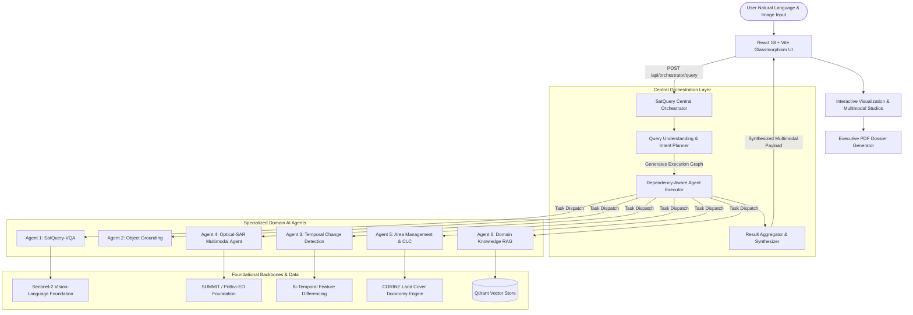

# 🛰️ SatQuery AI — Agentic Multimodal Earth Observation Platform

[](https://python.org)
[](https://fastapi.tiangolo.com)
[](https://pytorch.org)
[](https://reactjs.org)
[](https://vitejs.dev)
[](https://tailwindcss.com)
[](https://sentinel.esa.int)
[](https://qdrant.tech)
[](LICENSE)

> **SatQuery AI** is an advanced, enterprise-grade agentic multimodal artificial intelligence system built for unified satellite and aerial remote-sensing imagery analysis. Seamlessly fusing multispectral optical reflectance (**Sentinel-2**) with synthetic aperture radar (**Sentinel-1 SAR**), SatQuery AI transforms complex spatial Earth observation data into verifiable, actionable insights via conversational natural language.

---

## 📑 Table of Contents
- [Key Capabilities](#-key-capabilities)
- [System Architecture](#-system-architecture)
- [Multi-Agent Ecosystem](#-multi-agent-ecosystem)
- [Interactive Studios](#-interactive-studios)
- [Repository Structure](#-repository-structure)
- [Getting Started](#-getting-started)
- [API Reference](#-api-reference)
- [Datasets & Benchmarks](#-datasets--benchmarks)
- [Export & Reporting](#-export--reporting)
- [Contributing & Team](#-contributing--team)
- [License](#-license)

---

## 🌟 Key Capabilities

- 🔍 **Natural Language Geospatial Understanding**: Query complex satellite scenes in conversational English without specialized GIS query languages.
- 📡 **Optical-SAR Cross-Modal Perception**: Jointly reasons across Sentinel-2 multispectral reflectance and Sentinel-1 C-band SAR radar backscatter for cloud-penetrating analysis.
- 🕒 **Bi-Temporal Change Intelligence**: Detects, categorizes, and quantifies surface changes between historical and current satellite acquisitions.
- 🎯 **Open-Vocabulary Object Grounding**: Pinpoints and delineates infrastructure, buildings, runways, bodies of water, and vehicles with exact spatial bounding coordinates.
- 📐 **Automated Area & Land-Cover Measurement**: Computes precise real-world surface metrics (square meters, hectares, surface percentages) using 10m GSD spatial calibration.
- 📚 **Remote Sensing Domain RAG**: Grounded literature and physics explanations powered by an embedded vector database for satellite mission parameters, spectral indices, and radar scattering mechanisms.
- 🌐 **Embedded 3D Planetary Globe**: High-fidelity Three.js/Cesium 3D digital twin globe embedded directly into the analytical dashboard.
- 📄 **Executive PDF Dossier Generation**: Exports one-click publication-ready mission intelligence reports with visual layer diffs and verification metadata.

---

## 🏗️ System Architecture

SatQuery AI employs a decoupled, micro-orchestrated architecture consisting of a **Central Orchestrator**, six **Domain-Specific AI Agents**, a high-performance **FastAPI Service Bus**, and a modern **React/Vite Glassmorphism Frontend**.



---

## 🤖 Multi-Agent Ecosystem

The orchestrator dynamically routes queries to the optimal agent or executes parallel batches for compound queries:

### 1. Visual Question Answering (VQA) Agent
- **Core Engine**: Fine-tuned Vision-Language Model adapted for Earth Observation.
- **Capabilities**: High-level scene description, cloud classification, environmental condition assessment, and land-use reasoning.
- **Example Query**: *"What covers most of this coastal inlet?"*

### 2. Object Grounding Agent
- **Core Engine**: Open-vocabulary visual grounding with adjustable confidence threshold (`box_threshold`).
- **Capabilities**: Detects, localizes, and counts discrete targets (e.g. runways, hangars, bridges, commercial vessels, solar arrays, buildings) returning normalized `[ymin, xmin, ymax, xmax]` coordinates.
- **Example Query**: *"Locate and count all storage tanks in the industrial sector."*

### 3. Temporal Change Detection Agent
- **Core Engine**: Siamese bi-temporal radiometric and semantic differencing pipeline.
- **Output Layers**: Complete Overlay, Change Heatmap, Binary Mask, Raw Radiometric Difference, and Semantic Transition Maps.
- **Capabilities**: Identifies category shifts (e.g., *Vegetation → Infrastructure*, *Water → Bare Soil*), affected pixel volumes, and localized change clusters.
- **Example Query**: *"Compare both images and identify urban expansion between 2022 and 2026."*

### 4. Optical-SAR Multimodal Agent
- **Core Engine**: Cross-modal fusion pipeline for Sentinel-2 Multispectral + Sentinel-1 C-Band SAR.
- **7 Operational Modes**:
  1. *Optical Only* (S2 Multispectral)
  2. *SAR Only* (S1 Dual-Pol VV/VH)
  3. *Joint Alignment & Fusion* (Cross-attention token binding)
  4. *Temporal Verification* (Multi-pass radar verification)
  5. *BigEarthNet VQA Reasoning*
  6. *Multimodal Visual Grounding*
  7. *Full Geospatial Agent* (Fused radiometric + structural inference)
- **Example Query**: *"Give the multimodal insight about both optical and SAR files."*

### 5. Area Management & Land-Cover Agent
- **Core Engine**: Satellite color-space segmentation calibrated to 10m Ground Sampling Distance (GSD).
- **Taxonomy**: Mapped to the European CORINE Land Cover (CLC) standard (19-class and 43-class hierarchies).
- **Outputs**: Total surface area in hectares ($ha$) and square kilometers ($km^2$), fractional coverage, and class distribution histograms.
- **Example Query**: *"What percentage of this scene is covered by dense forest and water?"*

### 6. Remote Sensing Domain Knowledge (RAG) Agent
- **Core Engine**: Dense semantic retrieval using Qdrant Vector Store + LangChain embeddings.
- **Corpus**: ESA Sentinel documentation, NASA Earth Observatory papers, radar scattering equations, polarimetric decomposition literature, and spectral index formulations (NDVI, NDWI, NDBI).
- **Example Query**: *"Explain how double-bounce radar scattering identifies urban structures."*

---

## 🖥️ Interactive Studios

SatQuery AI provides bespoke interactive analytical studios embedded directly into the chat stream:

### 📡 Multimodal Sensor Inspection Studio
Designed for co-registered Optical + SAR pairs, featuring:
- **Instant Layer Switcher**: Toggle seamlessly between `Optical (S2)`, `SAR (S1)`, `Cross-Diff`, and `Fused` views.
- **Spatial Bounding Overlays**: Highlights cross-modal grounded features with tagged amber chips (*Bare Soil / Ground*, *Airfield Grass*, *Wet Body*).
- **Multi-Sensor Metrics Bar**:
  - **Interpretation Mode**: (e.g., `MODE A: CROSS-MODAL`)
  - **Modality Structural Alignment**: Correlation percentage score
  - **Dominant Land-Cover Class**: Primary identified terrain
  - **Multi-Sensor Confidence Score**: Model certainty percentage
- **Land Cover Surface Coverage**: Proportional colored progress bars with hectare breakdowns.

### 🔄 Change Intelligence Studio
Engineered for temporal surveillance and monitoring:
- **Dual-Temporal Split-Pane Viewer**: Interactive slider comparing T1 (Earlier) vs T2 (Later).
- **Layer Stacks**: Complete Blend Overlay, Intensity Heatmap, Binary Change Mask, and Raw Difference.
- **Category Filter Tabs**: Isolate specific transitions (*Building*, *Vegetation*, *Water*, *Infrastructure*).

---

## 📁 Repository Structure

```text
SatQueryAI/
├── frontend_backend/                # Core Web Application & Central Orchestrator
│   ├── backend/                     # FastAPI Application Backend
│   │   ├── app/
│   │   │   ├── orchestrator/        # Central Agent Orchestration Engine
│   │   │   │   ├── planner.py       # Query understanding & intent parsing
│   │   │   │   ├── router.py        # /api/orchestrator/query endpoint & router
│   │   │   │   ├── registry.py      # Standardized adapters for all 6 agents
│   │   │   │   ├── executor.py      # Dependency-aware execution graph runner
│   │   │   │   ├── aggregator.py    # Grounded answer synthesis & packaging
│   │   │   │   └── schemas.py       # Pydantic data models & trace schemas
│   │   │   ├── rag/                 # Qdrant Vector Store & retrieval service
│   │   │   └── reports/             # PDF generation and evidence management
│   │   └── main.py                  # Server bootstrap & CORS configuration
│   └── frontend/                    # Modern React 18 / Tailwind Frontend
│       ├── src/
│       │   ├── components/          # Reusable glassmorphic UI components
│       │   │   ├── MultimodalSensorStudio.jsx   # Optical-SAR Studio component
│       │   │   ├── ChangeIntelligenceStudio.jsx # Temporal change studio
│       │   │   └── DownloadReportButton.jsx     # Client-side PDF generator
│       │   ├── pages/               # Application routing views
│       │   │   ├── NewAnalysis.jsx  # Primary multi-agent conversational interface
│       │   │   ├── OpticalSARAnalysis.jsx # Dedicated Optical-SAR workspace
│       │   │   └── ThreeDView.jsx   # 3D Satellite Earth Globe view
│       │   └── index.css            # Custom design tokens, gradients & styles
├── grounding_change/                # Grounding, Segmentation & Optical-SAR Engine
│   ├── inference/
│   │   ├── agent_tools.py           # Optical-SAR & Grounding tool entry points
│   │   ├── optical_sar_pipeline.py  # Prithvi-EO / SUMMIT fusion pipeline
│   │   └── change_detector.py       # Bi-temporal change detection engine
│   └── schemas.py                   # Data contracts for change & SAR scenes
├── vqa_captioning/                  # Vision-Language (VQA) Subsystem
│   ├── models/                      # SatQuery-VQA architecture wrappers
│   ├── inference/                   # Standalone inference predictors
│   └── preprocessing/               # BigEarthNet & sensor normalization
├── area_measurement/                # Geospatial Surface & Area Quantification
│   └── segmentation.py              # Calibrated pixel-to-hectare segmentation
├── 3d-view/                         # Three.js 3D Satellite Globe Sub-app
├── docs/                            # Architectural specifications & training reports
├── start-dev.sh                     # Unified single-command development launcher
└── requirements.txt                 # Backend Python package dependencies
```

---

## 🚀 Getting Started

### Prerequisites
- **Python**: `3.10` or higher
- **Node.js**: `18.x` or higher (`npm` package manager)
- **Virtual Environment**: `venv` recommended

### 1. Clone the Repository
```bash
git clone https://github.com/amangupta982/SatQueryAI.git
cd SatQueryAI
```

### 2. Environment Setup
```bash
# Create and activate Python virtual environment
python3 -m venv venv
source venv/bin/activate

# Install backend dependencies
pip install -r requirements.txt

# Install frontend dependencies
cd frontend_backend/frontend
npm install
cd ../../3d-view
npm install
cd ..
```

### 3. Single-Command Full Stack Launch
SatQuery AI includes an automated process orchestrator that starts all services simultaneously:

```bash
chmod +x start-dev.sh
./start-dev.sh
```

This starts:
- **FastAPI Backend Service**: `http://localhost:8000`
- **SatQuery AI Main Portal**: `http://localhost:5173`
- **3D Planetary Engine**: `http://localhost:4173` *(embedded seamlessly)*

---

## 📡 API Reference

### Unified Multi-Agent Query Endpoint
Submit any natural language query along with image identifiers, base64 payloads, or uploaded files.

```http
POST /api/orchestrator/query
Content-Type: application/json
```

#### Sample Request Payload:
```json
{
  "query": "Give the insight about both files and measure vegetation coverage",
  "image_ids": ["optical_sample.tif", "sar_sample.tif"],
  "image_b64s": ["data:image/png;base64,...", "data:image/png;base64,..."],
  "modality": "SAR"
}
```

#### Sample Response Structure:
```json
{
  "success": true,
  "intent": "Optical-SAR Multimodal Fusion Analysis",
  "agents_used": ["optical_sar"],
  "answer": "Scene analyzed under mode_a_cross_modal. Detected classes: Infrastructure (57.4%), Low_vegetation (28.9%). Cross-sensor structural correlation is 79.8%.",
  "confidence": 0.89,
  "confidence_display": "89%",
  "bounding_boxes": [
    {
      "box": [0.65, 0.45, 0.75, 0.65],
      "label": "Airfield Grass (Low Veg) (South-East)",
      "confidence": 0.91
    }
  ],
  "optical_sar_data": {
    "session_id": "OS_A37E5262",
    "mode_applied": "mode_a_cross_modal",
    "cross_modal_correlation": 0.798,
    "category_proportions": {
      "Infrastructure": 0.574,
      "Low_vegetation": 0.289,
      "Building": 0.134,
      "Water": 0.002
    },
    "evidence_urls": {
      "optical_image": "/api/v1/optical-sar/evidence/OS_optical.png",
      "sar_image": "/api/v1/optical-sar/evidence/OS_sar.png",
      "cross_modal_diff": "/api/v1/optical-sar/evidence/OS_cross_diff.png",
      "fused_image": "/api/v1/optical-sar/evidence/OS_fused.png"
    }
  }
}
```

---

## 📊 Datasets & Benchmarks

SatQuery AI is trained, evaluated, and calibrated on premier remote sensing benchmarks:

| Benchmark | Sensor / Modality | Primary Task | Classes / Coverage |
|---|---|---|---|
| **BigEarthNet-MM** | Sentinel-1 (SAR) + Sentinel-2 (Optical) | Multimodal Scene Classification & VQA | 19 / 43 CORINE Land Cover classes |
| **VRSBench** | Very High Resolution (VHR) Optical | Visual Question Answering & Captioning | Open-vocabulary spatial questions |
| **RSVQA** | Low/High-Resolution Aerial & Satellite | Counting, Presence, and Comparison | Built-up, water, and agricultural metrics |
| **CDVQA** | Bi-Temporal Remote Sensing Pairs | Temporal Change Visual Question Answering | Urban expansion, deforestation, disaster events |

---

## 📑 Export & Reporting

Every analysis completed in SatQuery AI can be exported with a single click:
- **Format**: High-resolution Executive PDF Report.
- **Includes**: Session IDs, timestamped telemetry, execution trace, layer diff comparisons, land-cover statistical breakdown tables, and audit logs.
- **Use Cases**: Disaster response briefings, infrastructure planning audits, environmental compliance logs.

---

## 👥 Contributing & Team

Contributions to SatQuery AI are welcome! Please follow our established development workflow:
1. Create a feature branch: `git checkout -b feature/<module-name>-<short-description>`
2. Ensure linting and tests pass: `pytest` and `npm run build`
3. Submit a Pull Request detailing the changes and verification evidence.

---

## 📄 License

This project is licensed under the **MIT License** — see the [LICENSE](LICENSE) file for details.

---

<div align="center">
  <sub>Built with precision for Earth Observation researchers, geospatial analysts, and climate scientists worldwide.</sub><br>
  <b>SatQuery AI — Satellite Intelligence for a Smarter Planet</b>
</div>
